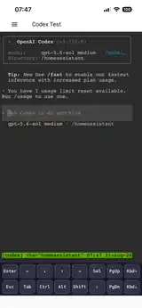

# Codex App for Home Assistant

[](https://opensource.org/licenses/MIT)
[](https://github.com/CaneTLOTW/ha-codex/actions/workflows/propose-codex-cli-update.yml)
[](https://github.com/CaneTLOTW/ha-codex/actions/workflows/publish-codex.yml)

Run OpenAI Codex from the Home Assistant sidebar with a maintained, image-pinned Home Assistant App.

This repository publishes one Home Assistant App: **Codex**. It provides a browser terminal inside Home Assistant, starts in the Home Assistant configuration directory, and can connect Codex to Home Assistant and additional services through MCP.

## Automatic Codex CLI updates

**Codex CLI updates are automated at the repository/image level.** This is a core architectural difference from the original project.

A scheduled GitHub Actions workflow checks `@openai/codex` every day at **04:17 UTC**. When a newer Codex CLI release or a changed visible model catalog is detected, the repository automatically:

1. reads the current model catalog from the new Codex CLI;
2. updates the pinned `CODEX_VERSION` in the image build;
3. refreshes the Home Assistant model dropdown from that catalog;
4. increments the Home Assistant App patch version;
5. adds the CLI update to the changelog;
6. commits and pushes the update to `main`;
7. that `codex/**` push triggers the image-publish workflow exactly once, which builds and publishes signed `amd64` and `aarch64` images plus the generic multi-architecture manifest.

Home Assistant then sees the new App version through the normal App Store update mechanism. If **Auto update** is enabled for the Codex App, Home Assistant can install that newly published version automatically.

This deliberately replaces runtime `npm install` updates. The running App does **not** modify its own Codex CLI installation; each Codex version is reproducibly built into a published container image and goes through the normal Home Assistant App release path.

## Mobile console



The maintained ttyd frontend is validated on-device with Home Assistant Companion on iOS. The current two-row toolbar provides `Enter`, arrows, `Sel`, `PgUp`/`PgDn`, `Esc`, `Tab`, one-shot `Ctrl`/`Alt`/`Shift`, Shift Lock (`⇪`), and explicit keyboard show/hide controls. `Sel` temporarily enables a DOM-backed native-selection path so iOS text selection, Copy, and Paste work without relying on programmatic clipboard reads.

Known-good `0.4.0` mobile runtime: **Codex CLI `0.151.0`**, **`gpt-5.6-sol`** (tested with medium reasoning), working directory **`/homeassistant`**, Home Assistant Companion on iPhone. The screenshot is a metadata-stripped repository copy of the final runtime test.

## Project Status

This project started from the original [`kecksdigital/codex-hass`](https://github.com/kecksdigital/codex-hass) codebase but is now maintained as an **independent repository**.

The original upstream `main` has not received a commit since **May 30, 2026**, while fixes and feature pull requests remain open. It currently appears to be unmaintained. Useful upstream contributions are reviewed and selectively ported here rather than treating upstream `main` as the release source.

This repository does **not** claim repository-level or installation-level drop-in compatibility merely because both Apps use the `codex` slug. Home Assistant can assign different repository/App data identities. If you are moving an existing installation from another repository, read [MIGRATION.md](MIGRATION.md) and verify the actual App data directories before copying anything.

## Why This Repository

The original App could become unusable after a runtime npm update because writable Home Assistant mounts are not executable under the App security model, while the unprivileged terminal user cannot safely replace the image-installed CLI.

This repository therefore:

- pins the Codex CLI into the published container image;
- **automatically detects new Codex CLI releases and publishes them as normal Home Assistant App versions**;
- keeps runtime npm updates out of the startup path;
- builds and tests a customized ttyd frontend for Home Assistant mobile use;
- maintains the Home Assistant MCP configuration without overwriting unrelated user settings;
- supports additional remote Streamable HTTP MCP servers and explicit Codex environment variables.

## Install

[](https://my.home-assistant.io/redirect/supervisor_add_addon_repository/?repository_url=https%3A%2F%2Fgithub.com%2FCaneTLOTW%2Fha-codex)

Manual installation:

1. Open **Settings → Apps → App Store** in Home Assistant.
2. Open **Repositories** from the three-dot menu.
3. Add `https://github.com/CaneTLOTW/ha-codex`.
4. Install **Codex**.
5. Start the App and open it from the sidebar.

### HACS

This project is a **Home Assistant App** (formerly called an add-on), not a custom integration. HACS does not manage Home Assistant Apps/add-ons, so this repository should be installed through the Home Assistant **App Store → Repositories** flow above, not through HACS.

## What You Get

- OpenAI Codex CLI running in Home Assistant.
- Prebuilt `amd64` and `aarch64` GHCR images with a generic multi-architecture manifest.
- Automated Codex CLI/model-catalog tracking and image publishing.
- Direct access to `/homeassistant`, `/share`, and `/media`.
- Read-only access to `/ssl` and `/backup`.
- Bundled Home Assistant MCP integration for entity lookup and service calls.
- Optional additional remote Streamable HTTP MCP servers.
- Optional environment variables for Codex/MCP sessions.
- Persistent Codex authentication and settings under `/data/codex-home`.
- Model, sandbox, approval, MCP, terminal theme, and session-persistence controls in the Home Assistant UI.
- Touch-friendly two-row mobile terminal controls with `Enter`, `Esc`, `Tab`, one-shot modifiers, Shift Lock, arrows, `Sel`, page navigation, and keyboard controls.
- Native iOS text selection/copy/paste through the opt-in `Sel` mode, while normal terminal input remains optimized for touch.
- Mobile swipe navigation and tmux copy-mode page navigation.
- Web-terminal Codex sessions that preserve output in xterm scrollback.

## Languages

The Home Assistant App configuration UI currently ships translations for:

- English (`en`)
- German (`de`)
- Spanish (`es`)
- Brazilian Portuguese (`pt-BR`)

These files cover the current App configuration schema, including MCP servers and environment variables. They localize the Home Assistant App options UI; the Codex CLI itself keeps its own upstream language behavior.

## Home Assistant packaging

The repository follows the current Home Assistant **App** repository model rather than HACS packaging. It provides `repository.yaml`, per-App `config.yaml`, `DOCS.md`, `CHANGELOG.md`, translations, AppArmor policy, prebuilt GHCR images, and a multi-architecture BuildKit publishing workflow.

The build/release setup is intentionally maintained against current Home Assistant App guidance. In particular, the App uses the generic multi-architecture image reference in `config.yaml` and the current composable Home Assistant builder actions instead of the retired legacy builder action.

## Authentication

Codex authentication happens inside the terminal. Home Assistant does not need to store your OpenAI API key, ChatGPT session, or Codex access token in App options.

Credentials that you explicitly configure for an additional MCP server or as an environment variable are stored in Home Assistant App options and made available only to the Codex runtime environment. MCP bearer-token values are referenced from Codex configuration through generated environment-variable names rather than being written directly into `config.toml`.

## Defaults

- Model: `gpt-5.6-sol`; the selectable model list is maintained from the bundled Codex CLI catalog.
- Access: `workspace`.
- Approval policy: `on-request`.
- Session persistence: off by default; previous Codex conversations remain available through `codex resume`.
- Bundled Home Assistant MCP: on.
- Codex CLI updates: automatically delivered through Home Assistant App versions, not runtime npm updates.

Use `full_access` only when broad local access inside the App container is intended. Use `codex_approval_policy: never` only when autonomous execution without per-action approval prompts is intended.

## Updates

The scheduled **Update Codex CLI** workflow is the source of automated Codex releases. It checks npm for the newest `@openai/codex`, keeps the model dropdown synchronized with the bundled CLI catalog, increments the App version when needed, and pushes the changed `codex/**` files to `main`. That push is the single trigger for the **Publish Codex App** workflow.

The publish workflow creates the versioned and `latest` images at:

```text
ghcr.io/canetlotw/ha-codex:<version>
```

Enable **Auto update** on the Codex App page if Home Assistant should install newly published App versions automatically.

## Documentation

- [Home Assistant App documentation](codex/DOCS.md)
- [Detailed repository guide](codex/README.md)
- [Migration notes](MIGRATION.md)
- [ttyd mobile-control implementation notes](codex/ttyd-mobile-keys/README.md)

Useful Codex documentation:

- [Codex CLI](https://developers.openai.com/codex/cli)
- [Codex authentication](https://developers.openai.com/codex/auth)
- [Codex configuration](https://developers.openai.com/codex/config-basic)
- [Codex configuration reference](https://developers.openai.com/codex/config-reference)
- [Codex MCP configuration](https://developers.openai.com/codex/mcp)

## Support and Contributions

- [Issues](https://github.com/CaneTLOTW/ha-codex/issues)
- [Pull requests](https://github.com/CaneTLOTW/ha-codex/pulls)

Bug fixes and focused improvements are welcome. Contributions from the original repository are reviewed for compatibility with this repository's image-pinned update model and current Home Assistant App architecture.

## License

MIT License
